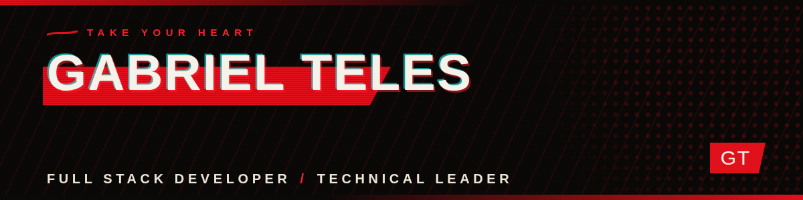
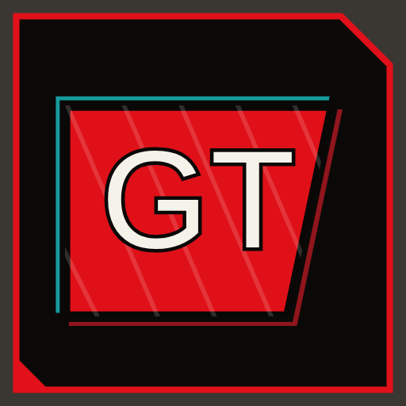

 

## 🗡️ About Me

Software developer with **4+ years of experience** building web, mobile and real-time systems — from chat platforms with voice/video to production management systems used by real clinics and gyms. I lead small teams end-to-end: architecture, delivery and everything in between.

- 🔭 Currently building **Nebula** — a full-stack Discord-style platform (.NET 8 + SignalR + LiveKit + React)
- 🌱 Deepening **Clean Architecture, real-time systems (WebRTC/SignalR) and cloud infrastructure (AWS, Terraform)**
- 🎮 Side quest: prototyping **TEV: The Eldritch Vanguard**, an idle RPG that lives in your Windows taskbar
- 💬 Ask me about **Full Stack Development, Technical Leadership and Software Architecture**
- 📫 **gabrieltelessantos48@gmail.com**

 

## 🗡️ Skills

**Languages**

**Frontend**

**Backend & Real-Time**

**Database, Cloud & DevOps**

**Game Dev & Mobile**

 

## 🗡️ Featured Projects

<table>
  <tr>
    <td width="50%" valign="top">
      <h3>🔴 Nebula <i>in progress</i></h3>
      
<b>Discord-style platform</b> built end-to-end: text/voice channels, real-time messaging, presence, voice/video/screen-share calls and JWT auth with rotating refresh tokens.

      
<b>Stack:</b> ASP.NET Core 8 · SignalR · LiveKit · MongoDB · Redis · MinIO · React + TS · Docker Compose

      

        
        
      

    </td>
    <td width="50%" valign="top">
      <h3>🏋️ GymForge — Personal Pro <i>in production</i></h3>
      
Three-app ecosystem for personal trainers: web panel with load/volume progression charts, an API with dual trainer/student auth, and a mobile app that requires a photo check-in before logging a workout.

      
<b>Stack:</b> React 19 + MUI · Node/Express · MongoDB · Expo/React Native · AWS (S3, CloudFront, EC2) · Terraform

      

        
        
        
      

    </td>
  </tr>
  <tr>
    <td width="50%" valign="top">
      <h3>🏥 White Label — Clinic System <i>in production</i></h3>
      
Multidisciplinary clinic management platform: patients, scheduling, medical/nutrition/psychology/social-service records, home-visit requests and PDF/DOCX report generation.

      
<b>Stack:</b> .NET 8 (Clean Architecture) · React + TS + MUI · react-hook-form + zod · AWS · Docker

      

        
        
      

    </td>
    <td width="50%" valign="top">
      <h3>⚔️ TEV: The Eldritch Vanguard <i>prototype</i></h3>
      
Idle/incremental RPG that runs docked to the Windows taskbar — heroes auto-walk, auto-fight and auto-loot while you work. Engine-agnostic design doc so it can be ported between Unity and GameMaker.

      
<b>Stack:</b> Unity (URP 2D) · C# · ScriptableObjects · PixelLab-assisted pixel art

      

        
        
      

    </td>
  </tr>
  <tr>
    <td width="50%" valign="top">
      <h3>📖 RPG Sheet Scanner <i>v1.0.0</i></h3>
      
100% offline mobile app for managing character sheets across 10 tabletop RPG systems, with camera-based OCR (ML Kit / Tesseract.js) to speed up filling them in. Zero network calls, zero tracking.

      
<b>Stack:</b> React Native + Expo · TypeScript · ML Kit · Tesseract.js · AsyncStorage

      

        
      

    </td>
    <td width="50%" valign="top">
      <h3>🌐 Instituto JC — Landing Carísio <i>client project</i></h3>
      
Pixel-perfect recreation of a real institutional landing page from screenshots alone: autoplay muted hero video, an independent floating music player and a responsive comparison table.

      
<b>Stack:</b> React 19 · TypeScript · Vite · Tailwind CSS 4 · lucide-react

      

        
      

    </td>
  </tr>
</table>

<b>🗡️ Other projects (archive)</b>

 

| Project | Description | Stack |
|---|---|---|
| [Happy](https://github.com/zdog10127/Happy) · [live](https://happy-five.vercel.app) | Social app connecting volunteers to child-care shelters — built in a 1-week bootcamp (NLW/Rocketseat) | React · TypeScript · Node.js |
| [React Pokédex](https://github.com/zdog10127/react-pokedex) ⭐1 | Responsive Pokédex consuming the PokéAPI with Redux Toolkit for global state | React · TypeScript · Redux Toolkit |
| [Video Processing System](https://github.com/zdog10127/video-processing) | Video upload/processing API with async queues, FFmpeg conversion and auto-generated thumbnails | NestJS · Bull/Redis · FFmpeg · GCS |
| [Metropole Garage](https://github.com/zdog10127/metropole-garage) | Vehicle management system for a FiveM (GTA RP) server, synced live with the game | React · FiveM · MySQL |
| [Valoriza](https://github.com/zdog10127/Valoriza) | Peer-recognition platform to strengthen team culture | Node.js · Express · TypeORM · JWT |
| [DarkShame](https://github.com/zdog10127/DarkShame) | Social platform for gamers to play, create and discover games | C# |

 

## 🗡️ GitHub Stats

  
  
   
  

 

  

